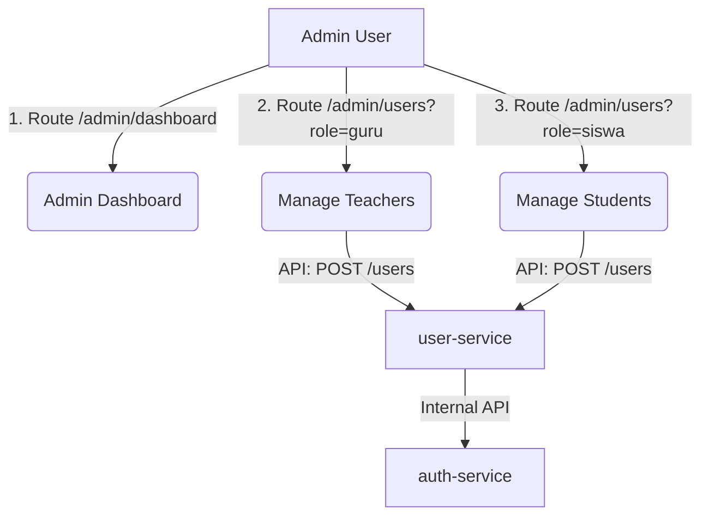

# 🛡️ Admin Dashboard & User Management

The Administration module provides the tools necessary to configure, provision, and maintain accounts across the Triton Tryout ecosystem. It isolates management interfaces for Teachers (`guru`) and Students (`siswa`) to ensure precise role scoping and system organization.

---

## 🏗️ System Overview

The Admin portal is divided into:
1.  **System Statistics Dashboard**: Provides real-time operational counts.
2.  **Guru Management Portal**: Handles teacher registration, credentials, and subject assignments.
3.  **Siswa Management Portal**: Handles student grouping, classes, and registration lifecycle.



---

## 🗄️ Database Schema Mapping

User accounts split their data between credential tables in `db_auth` and descriptive details in `db_user`.

### Profile Database Schema (`db_user`)
```sql
CREATE TABLE IF NOT EXISTS profiles (
  id             UUID PRIMARY KEY DEFAULT gen_random_uuid(),
  user_id        UUID UNIQUE NOT NULL,
  nama_lengkap   VARCHAR(255) NOT NULL,
  no_telepon     VARCHAR(20),
  kelas          VARCHAR(50),       -- Populated for Siswa (e.g. '12 IPA 1')
  mata_pelajaran VARCHAR(255),      -- Populated for Guru (e.g. 'Fisika, Matematika')
  avatar_url     TEXT,
  bio            TEXT,
  created_at     TIMESTAMPTZ DEFAULT NOW(),
  updated_at     TIMESTAMPTZ DEFAULT NOW()
);
```

---

## 📡 API Spec Sheet

### 1. Retrieve User Registry
*   **Method & Route**: `GET /users`
*   **Query Parameters**:
    *   `role` (optional): `admin` | `guru` | `siswa`
*   **Response (200 OK)**:
    ```json
    {
      "success": true,
      "data": [
        {
          "id": "c0556da0-c44d-4ba2-b2f7-b8924b17bf7b",
          "email": "guru1@triton.id",
          "role": "guru",
          "is_active": true,
          "created_at": "2026-06-09T02:00:00.000Z",
          "profile": {
            "nama_lengkap": "Dodik Sukma, S.Pd",
            "no_telepon": "08123456789",
            "kelas": null,
            "mata_pelajaran": "Fisika",
            "avatar_url": null,
            "bio": "Physics Educator"
          }
        }
      ]
    }
    ```

### 2. Register New User Account
*   **Method & Route**: `POST /users`
*   **Payload (JSON)**:
    ```json
    {
      "email": "siswa_new@triton.id",
      "password": "securepassword123",
      "role": "siswa",
      "nama_lengkap": "Made Adnya",
      "no_telepon": "0876543210",
      "kelas": "12 IPA 2"
    }
    ```
*   **Response (201 Created)**:
    ```json
    {
      "success": true,
      "data": {
        "id": "b3c9a17d-...",
        "email": "siswa_new@triton.id",
        "role": "siswa",
        "is_active": true,
        "profile": {
          "nama_lengkap": "Made Adnya",
          "no_telepon": "0876543210",
          "kelas": "12 IPA 2",
          "mata_pelajaran": null
        }
      },
      "message": "Pengguna berhasil ditambahkan."
    }
    ```

### 3. Toggle Account Activation State
*   **Method & Route**: `PATCH /users/:id/active`
*   **Payload (JSON)**:
    ```json
    {
      "is_active": false
    }
    ```
*   **Response (200 OK)**: Returns updated auth user object metadata.

### 4. Update Profile Details
*   **Method & Route**: `PUT /users/:id`
*   **Payload (JSON)**:
    ```json
    {
      "nama_lengkap": "Made Adnya Pratama",
      "no_telepon": "0876543299",
      "kelas": "12 IPA 3",
      "bio": "Updated bio"
    }
    ```
*   **Response (200 OK)**: Returns the updated profile record.

### 5. Remove User Account
*   **Method & Route**: `DELETE /users/:id`
*   **Response (200 OK)**:
    ```json
    {
      "success": true,
      "data": null,
      "message": "Pengguna dihapus."
    }
    ```
    *Deletes data from both `profiles` and `users` (credentials) tables synchronously.*

---

## 💻 Frontend Interface Features

### 📊 Admin Dashboard (`/admin/dashboard`)
*   **Metric Grid**: Display cards for:
    *   **Total Registered Users**: Count of all accounts in the database.
    *   **Active Tryout Sets**: Total tryouts with the state `published`.
    *   **Active Sessions**: Count of students currently taking an exam.
*   **Recent Activity Log**: Stream of newly completed tryouts, scores, and registrations.

### 👥 User Registry View (`/admin/users`)
*   **Role Separation Tabs**: Keeps Teacher and Student administrative controls physically separate to prevent misclicks.
*   **Search**: Real-time filtering by Name or Email address.
*   **Actions Menu**:
    *   *Create*: Integrated dialog modals to add new accounts. Forms include validation schemas checking parameter constraints (e.g. minimum password lengths).
    *   *Edit*: Dialog form populated with active record metadata.
    *   *Status Switch*: Accessible toggle switches to suspend/activate accounts instantly.
    *   *Delete*: Prompt dialog confirming absolute removal before invoking API requests.
