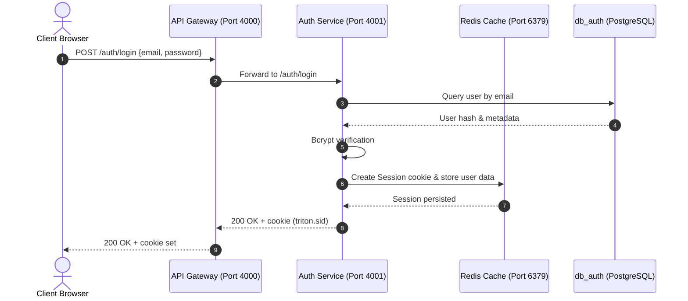

# 🔐 Multi-Role Authentication & Access Control

The Triton platform implements a secure, centralized, role-based access control (RBAC) mechanism. This is governed by a microservices-aligned architecture where session storage is decentralized using Redis, and client-side page routing is strictly isolated via Next.js Middleware.

---

## 🏗️ Technical Architecture



---

## 🗄️ Database Schema (`db_auth`)

```sql
CREATE TABLE IF NOT EXISTS users (
  id            UUID PRIMARY KEY DEFAULT gen_random_uuid(),
  email         VARCHAR(255) UNIQUE NOT NULL,
  password_hash VARCHAR(255) NOT NULL,
  role          VARCHAR(20) NOT NULL CHECK (role IN ('admin','guru','siswa')),
  is_active     BOOLEAN DEFAULT true,
  created_at    TIMESTAMPTZ DEFAULT NOW(),
  updated_at    TIMESTAMPTZ DEFAULT NOW()
);
```

---

## 📡 API Spec Sheet

### Public Endpoints (Exposed through Gateway)

#### 1. User Login
*   **Method & Route**: `POST /auth/login`
*   **Payload (JSON)**:
    ```json
    {
      "email": "user@triton.id",
      "password": "user123"
    }
    ```
*   **Response (200 OK)**:
    ```json
    {
      "success": true,
      "data": {
        "userId": "e6a2b8e3...",
        "role": "guru",
        "email": "user@triton.id"
      }
    }
    ```
    *Sets session cookie `triton.sid` in client browser headers.*

#### 2. User Logout
*   **Method & Route**: `POST /auth/logout`
*   **Response (200 OK)**:
    ```json
    {
      "success": true,
      "data": null,
      "message": "Berhasil logout"
    }
    ```
    *Clears `triton.sid` cookie and invalidates session in Redis.*

#### 3. Identity Resolution
*   **Method & Route**: `GET /auth/me`
*   **Headers**: Requires cookie `triton.sid`
*   **Response (200 OK)**:
    ```json
    {
      "success": true,
      "data": {
        "userId": "e6a2b8e3...",
        "role": "guru",
        "email": "user@triton.id"
      }
    }
    ```

#### 4. Change Password
*   **Method & Route**: `POST /auth/change-password`
*   **Payload (JSON)**:
    ```json
    {
      "oldPassword": "oldPassword123",
      "newPassword": "newPassword123"
    }
    ```
*   **Response (200 OK)**:
    ```json
    {
      "success": true,
      "data": null,
      "message": "Password berhasil diubah"
    }
    ```

### Internal Endpoints (Reachable only by internal services)
Internal endpoints allow synchronization of credential records (e.g., when the Admin adds/deletes a Teacher or Student in the `user-service`).
*   `POST /internal/users` — Synchronize new user record.
*   `PATCH /internal/users/:id` — Update status (`is_active`), change password, or adjust role.
*   `DELETE /internal/users/:id` — Delete user credentials.
*   `GET /internal/users` — Get all auth-registered accounts.

---

## 🛡️ Route Protection & Access Guarding

Access is guarded at two levels: the **Frontend Router** and the **API Gateway Router**.

### 1. Frontend Route Guarding (`middleware.ts`)
Next.js 14 Middleware intercepts requests to secure paths and inspects active credentials:
*   **Path `/admin/*`**: Accessible only if user has cookie and resolved role is `'admin'`.
*   **Path `/guru/*`**: Accessible only if user has cookie and resolved role is `'guru'`.
*   **Path `/siswa/*`**: Accessible only if user has cookie and resolved role is `'siswa'`.
*   **Direct Redirection**: If a logged-in user visits the landing `/` or `/login` page, they are automatically redirected to their respective role dashboard. Unauthenticated requests to protected directories are sent directly to `/login`.

### 2. Backend Gateway Guarding (`auth.middleware.ts`)
The API Gateway acts as a reverse proxy, parsing incoming cookies, calling `/auth/me` internally, and injecting the following request headers:
*   `x-user-id`: Identifies the session owner.
*   `x-user-role`: Identifies the session role.

If the incoming token is expired or missing, the Gateway halts the request chain immediately, returning a `401 Unauthorized` response.
If an endpoint restricts operations to a specific role using `requireRole('admin')` or `requireRole('guru')`, and the header does not match, a `403 Forbidden` error is returned.
