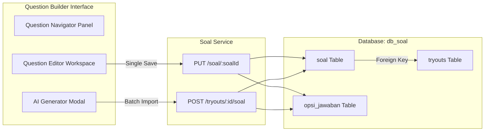

# 🗄️ Question Builder & AI Question Generator

The Question Builder is a high-grade assessment creation interface designed for teachers (`guru`). It features a split-pane workstation supporting complex formats (HTML formatting, mathematical LaTeX equations, image embeddings) and integrates an AI-powered mock question generator to expedite test authoring.

---

## 🏗️ Technical Architecture



---

## 🗄️ Database Schemas (`db_soal`)

Questions and multiple-choice options are stored across the `soal` and `opsi_jawaban` tables:

```sql
CREATE TABLE IF NOT EXISTS soal (
  id              UUID PRIMARY KEY DEFAULT gen_random_uuid(),
  tryout_id       UUID NOT NULL REFERENCES tryouts(id) ON DELETE CASCADE,
  nomor_soal      INTEGER NOT NULL,
  tipe            VARCHAR(20) NOT NULL CHECK (tipe IN ('pilihan_ganda','essay')),
  pertanyaan      TEXT NOT NULL,
  pertanyaan_html TEXT,
  gambar_url      TEXT,
  gambar_base64   TEXT,
  equation        TEXT,
  equation_latex  TEXT,
  panduan_essay   TEXT,
  bobot           INTEGER NOT NULL DEFAULT 1,
  created_at      TIMESTAMPTZ DEFAULT NOW()
);

CREATE TABLE IF NOT EXISTS opsi_jawaban (
  id        UUID PRIMARY KEY DEFAULT gen_random_uuid(),
  soal_id   UUID NOT NULL REFERENCES soal(id) ON DELETE CASCADE,
  huruf     CHAR(1) NOT NULL,
  teks      TEXT NOT NULL,
  teks_html TEXT,
  is_benar  BOOLEAN DEFAULT false
);
```

---

## 📡 API Spec Sheet

### 1. Append Question to Tryout Sheet
*   **Method & Route**: `POST /tryouts/:id/soal`
*   **Payload (JSON)**:
    ```json
    {
      "tipe": "pilihan_ganda",
      "pertanyaan": "Solve for x: 2x - 4 = 10",
      "pertanyaan_html": "<p>Solve for <strong>x</strong>: 2x - 4 = 10</p>",
      "equation_latex": "2x - 4 = 10 \\Rightarrow 2x = 14",
      "bobot": 2,
      "opsi": [
        { "huruf": "A", "teks": "5", "is_benar": false },
        { "huruf": "B", "teks": "7", "is_benar": true },
        { "huruf": "C", "teks": "9", "is_benar": false }
      ]
    }
    ```
*   **Response (201 Created)**: Returns enriched question record with generated option IDs.

### 2. Update Question Details & Options
*   **Method & Route**: `PUT /soal/:soalId`
*   **Payload (JSON)**: Same structure as `POST /tryouts/:id/soal`.
*   **Response (200 OK)**: Returns the updated question record containing its options.
    *Deletes prior option records and recreates the collection in a database transaction block.*

### 3. Remove Question
*   **Method & Route**: `DELETE /soal/:soalId`
*   **Response (200 OK)**:
    ```json
    {
      "success": true,
      "data": null,
      "message": "Soal dihapus"
    }
    ```

---

## 💻 Frontend Interface Features

### 🛠️ Question Builder Workspace (`/guru/tryout/[id]/soal`)
*   **Split Pane Layout**:
    *   **Left Navigation Panel**: Vertically scrollable index list displaying question numbers, snippet content previews, and their weight metrics (`bobot`). Provides a "Add Question" button at the bottom.
    *   **Right Editor Panel**: Context-aware form. Changes input fields dynamically based on the selected question type:
        *   *Pilihan Ganda (Multiple Choice)*: Displays five option fields (A-E) with markdown text inputs and radio buttons to mark the correct choice.
        *   *Essay*: Displays a text box to define grading guidelines (`panduan_essay`) for manual reference scoring.
*   **Formula Formatting (LaTeX)**: Input fields for LaTeX math markup. Uses local client libraries to render preview formulas instantly using KaTeX styling.
*   **Image Embeddings**: Supports drag-and-drop file inputs converting graphics into localized `Base64` encoding data strings stored directly in the database.

### 🤖 AI Soal Generator (`FEAT-001`)
*   **Mock Generation Pipeline**:
    1.  User clicks the **"Generate dengan AI"** button in the question list panel.
    2.  An configuration dialog opens with the following inputs:
        *   **Subject**: Mathematics, Physics, or Biology.
        *   **Quantity**: 1 or 5 questions.
    3.  Clicking **"Generate"** displays a loading animation (simulating API latency using a 1.5-second timer delay).
    4.  The generator pulls structured JSON objects from predefined presets (`AI_PRESETS` in `ai-presets.ts`).
    5.  Questions are rendered inside a **review modal**. The teacher can edit any field (such as option texts, weight, or question phrasing) before confirming.
    6.  Clicking **"Simpan Semua"** batch inserts the questions to the database via API requests.
