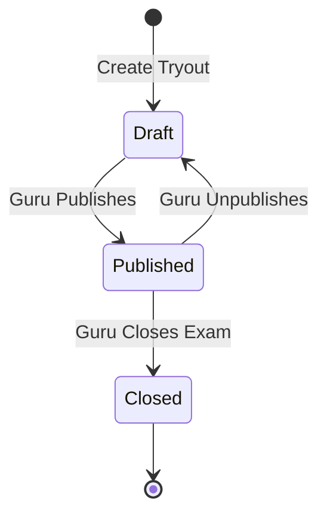

# 📝 Guru Dashboard & Tryout Management

The Teacher (`guru`) module provides the interface for authoring examinations (tryouts), controlling test visibility lifecycle states, and analyzing students' tryout performance recaps.

---

## 🏗️ System Overview

Teachers manage a collection of tryouts. A tryout acts as a root container for individual questions.



---

## 🗄️ Database Schema Mapping (`db_soal`)

```sql
CREATE TABLE IF NOT EXISTS tryouts (
  id             UUID PRIMARY KEY DEFAULT gen_random_uuid(),
  nama_tryout    VARCHAR(255) NOT NULL,
  mata_pelajaran VARCHAR(100) NOT NULL,
  durasi_menit   INTEGER NOT NULL DEFAULT 90,
  dibuat_oleh    UUID NOT NULL,       -- References users(id) in db_auth
  status         VARCHAR(20) DEFAULT 'draft' CHECK (status IN ('draft','published','closed')),
  created_at     TIMESTAMPTZ DEFAULT NOW(),
  updated_at     TIMESTAMPTZ DEFAULT NOW()
);
```

---

## 📡 API Spec Sheet

### 1. Fetch Owned Tryouts
*   **Method & Route**: `GET /tryouts`
*   **Response (200 OK)**:
    ```json
    {
      "success": true,
      "data": [
        {
          "id": "e44de0d2-...",
          "nama_tryout": "Tryout Matematika Saintek 1",
          "mata_pelajaran": "Matematika",
          "durasi_menit": 120,
          "dibuat_oleh": "guru-uuid-here",
          "status": "published",
          "soal_count": 15,
          "total_bobot": 35,
          "created_at": "2026-06-09T03:00:00.000Z",
          "updated_at": "2026-06-09T03:00:00.000Z"
        }
      ]
    }
    ```

### 2. Create Tryout Sheet
*   **Method & Route**: `POST /tryouts`
*   **Payload (JSON)**:
    ```json
    {
      "nama_tryout": "Simulasi Fisika UN",
      "mata_pelajaran": "Fisika",
      "durasi_menit": 90
    }
    ```
*   **Response (201 Created)**: Returns the newly created tryout record.

### 3. Update Tryout Metadata
*   **Method & Route**: `PUT /tryouts/:id`
*   **Payload (JSON)**:
    ```json
    {
      "nama_tryout": "Simulasi Fisika UN - Revised",
      "mata_pelajaran": "Fisika",
      "durasi_menit": 100
    }
    ```
*   **Response (200 OK)**: Returns the modified tryout record.

### 4. Transition Tryout Status (Publish / Unpublish / Close)
*   **Method & Route**: `PATCH /tryouts/:id/publish`
*   **Payload (JSON)**:
    ```json
    {
      "status": "published" // Options: 'draft' | 'published' | 'closed'
    }
    ```
*   **Response (200 OK)**: Returns the modified tryout record.

### 5. Remove Tryout Sheet
*   **Method & Route**: `DELETE /tryouts/:id`
*   **Response (200 OK)**:
    ```json
    {
      "success": true,
      "data": null,
      "message": "Tryout dihapus"
    }
    ```
    *Wipes all associated questions (`soal`), options (`opsi_jawaban`), and answers (`jawaban`) due to foreign key cascades.*

---

## 💻 Frontend Interface Features

### 📊 Tryout Dashboard Overview (`/guru/dashboard`)
*   **Stat Cards Grid**:
    *   **Tryouts Created**: Total count of exams created by the logged-in teacher.
    *   **Total Questions**: Accumulated count of questions across all owned tryouts.
    *   **Active Participants**: Number of students who have completed at least one exam.
*   **Status Filter Tabs**:
    *   *Semua*: Show all tryouts.
    *   *Aktif*: Filter for status = `published`.
    *   *Draft*: Filter for status = `draft`.
    *   *Selesai*: Filter for status = `closed`.
*   **Actions Menu (dropdown "⋯" on Tryout cards)**:
    *   **Kelola Soal**: Directs to the Question Builder interface (`/guru/tryout/{id}/soal`).
    *   **Lihat Hasil Siswa**: Directs to the student scores recap screen (`/guru/tryout/{id}/hasil`).
    *   **Edit Tryout**: Opens a modal Dialog to modify details like name, duration, and subject.
    *   **Hapus Tryout**: Displays an alert confirmation dialog. If confirmed, deletes the tryout and its contents.

### 📈 Student Performance Recap Collapsible Panel
*   Under each tryout card, teachers can toggle a **collapsible panel** that fetches the test's submission records.
*   **List View**: Shows student name, class, and their grade.
*   **Score Grading Color Badge**:
    *   `>= 90`: Green (Outstanding)
    *   `75 - 89`: Blue (Proficient)
    *   `60 - 74`: Amber (Passing)
    *   `< 60`: Red (Needs Improvement)
*   **Overflow Indicator**: Displays a "+ X other students" link pointing to the detailed results list.
