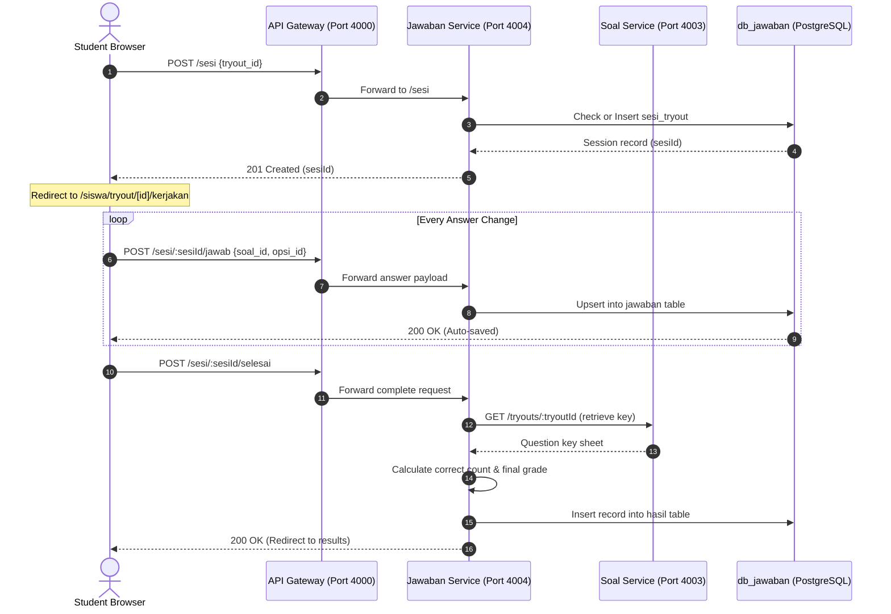

# ✍️ Siswa Portal & Exam Engine

The Student (`siswa`) module enables test takers to search and filter active examinations, sit for tryouts inside a distraction-free exam cockpit (CBT environment) with mathematical formatting, auto-saving answer records, and review immediate performance metrics.

---

## 🏗️ Technical Architecture & Exam Flow



---

## 🗄️ Database Schema Mapping (`db_jawaban`)

```sql
CREATE TABLE IF NOT EXISTS sesi_tryout (
  id         UUID PRIMARY KEY DEFAULT gen_random_uuid(),
  siswa_id   UUID NOT NULL,
  tryout_id  UUID NOT NULL,
  mulai_at   TIMESTAMPTZ DEFAULT NOW(),
  selesai_at TIMESTAMPTZ,
  status     VARCHAR(20) DEFAULT 'berlangsung' CHECK (status IN ('berlangsung','selesai','timeout')),
  UNIQUE(siswa_id, tryout_id)
);

CREATE TABLE IF NOT EXISTS jawaban (
  id           UUID PRIMARY KEY DEFAULT gen_random_uuid(),
  sesi_id      UUID NOT NULL REFERENCES sesi_tryout(id),
  soal_id      UUID NOT NULL,
  jawaban_teks TEXT,
  opsi_id      UUID,
  created_at   TIMESTAMPTZ DEFAULT NOW(),
  updated_at   TIMESTAMPTZ DEFAULT NOW(),
  UNIQUE(sesi_id, soal_id)
);

CREATE TABLE IF NOT EXISTS hasil (
  id          UUID PRIMARY KEY DEFAULT gen_random_uuid(),
  sesi_id     UUID UNIQUE NOT NULL REFERENCES sesi_tryout(id),
  siswa_id    UUID NOT NULL,
  tryout_id   UUID NOT NULL,
  total_benar INTEGER DEFAULT 0,
  total_soal  INTEGER NOT NULL,
  nilai       NUMERIC(5,2),
  dihitung_at TIMESTAMPTZ DEFAULT NOW()
);
```

---

## 📡 API Spec Sheet

### 1. Initiate or Resume Tryout Session
*   **Method & Route**: `POST /sesi`
*   **Payload (JSON)**:
    ```json
    {
      "tryout_id": "8b9e6c3a-..."
    }
    ```
*   **Response (201 Created or 200 OK)**: Returns the active session object `sesi_tryout`. If a session exists and is completed, returns `409 Conflict`.

### 2. Auto-Save Answer Choice
*   **Method & Route**: `POST /sesi/:sesiId/jawab`
*   **Payload (JSON)**:
    ```json
    {
      "soal_id": "0fa5b6de-...",
      "opsi_id": "d04a6b22-..." // Optional: Used for PG questions
    }
    ```
*   **Response (200 OK)**: Returns the saved answer record.
    *Upserts answer using constraints (`sesi_id`, `soal_id`).*

### 3. Conclude Exam Session (Final Submit)
*   **Method & Route**: `POST /sesi/:sesiId/selesai`
*   **Response (200 OK)**: Returns the grading result `hasil` object.
    *Locks the session (`status = 'selesai'`), calls `soal-service` internally to retrieve the correct answer keys, auto-grades responses, and commits the score to the database.*

### 4. Fetch Score & Questions Review Details
*   **Method & Route**: `GET /hasil/:sesiId`
*   **Response (200 OK)**:
    ```json
    {
      "success": true,
      "data": {
        "hasil": { "total_benar": 12, "total_soal": 15, "nilai": "80.00" },
        "sesi": { "mulai_at": "...", "selesai_at": "..." },
        "detail": [
          {
            "soal": { "pertanyaan_html": "..." },
            "student_opsi": { "huruf": "A", "teks": "Answer text" },
            "correct_opsi": { "huruf": "A", "teks": "Answer text" },
            "is_correct": true,
            "is_skipped": false
          }
        ]
      }
    }
    ```

### 5. Fetch Student Historical Attempts
*   **Method & Route**: `GET /riwayat`
*   **Response (200 OK)**: Lists all student tryout sessions with their scores.

---

## 💻 Frontend Interface Features

### 📊 Dashboard & Filtering (`/siswa/dashboard` & `/siswa/tryout`)
*   **Performance Counters**: Overview of available, ongoing, and completed tryouts alongside their average score grade.
*   **Tryout Cards**: Filterable list of published tests with search inputs, subject tags, and button states (`Mulai Tryout`, `Lanjutkan`, `Lihat Hasil`).

### ⏱️ CBT Exam Interface (`/siswa/tryout/[id]/kerjakan`)
*   **Distraction-Free Mode**: The navigation sidebar and main header elements are fully hidden to replicate standard computer-based test formats.
*   **Sticky Header Panel**: Displays the test name, a progress indicator, a client-synchronized countdown timer, and a final "Kumpulkan" (Submit) button.
*   **Left Navigation Grid**: Box grid indexing all question numbers. Uses color codes for states:
    *   *Blue*: Answered.
    *   *Slate/Bordered*: Unanswered.
    *   *Amber*: Flagged (Ragu-ragu).
*   **Main Workspace**: Displays questions styled with HTML formatting and mathematical equations rendered via KaTeX.
*   **Real-time Synchronization**: Every option click triggers a POST request in the background. If the user disconnects or refreshes, their answers are restored.
*   **Auto-Submit**: If the timer hits zero, the client triggers the submit action automatically to prevent late submissions.

### 🏆 Score Review Screen (`/siswa/hasil/[sesiId]`)
*   **Grade Card**: Prominently displays the final score and grade badge (A, B, C, or D).
*   **Results Chart**: Visual chart showing the ratio of correct responses, incorrect answers, and skipped questions.
*   **Detailed Correction Review**: Renders all questions with indicators showing what was answered vs what was correct.
